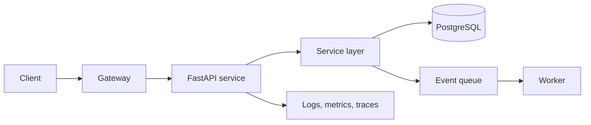

# Backend, Data, and AI Project Deep-Dive Guide

> **Purpose:** Company-neutral answers and implementation examples for resume
> deep-dives and production scenario interviews.

## Python Microservices

### Explain the architecture and purpose of the services

A strong answer starts with the system boundary, not the framework:

> The platform exposed versioned REST APIs through an ingress or API gateway.
> Stateless FastAPI services owned separate business capabilities and accessed
> PostgreSQL through a service and repository layer. Long-running work was sent
> to a queue so the request path stayed responsive. Services emitted structured
> logs, metrics, and traces, and were packaged as containers for Kubernetes.



Personal contribution should be explicit: name the endpoint, domain logic,
schema, test, deployment control, or production issue you owned.

### Why FastAPI

FastAPI is useful when a Python service benefits from typed request validation,
OpenAPI generation, dependency injection, and asynchronous I/O. It does not make
CPU-bound Python work parallel; that work belongs in a worker process or separate
compute service.

```python
from typing import Annotated

from fastapi import Depends, FastAPI, HTTPException
from pydantic import BaseModel, Field

app = FastAPI()


class OrderCreate(BaseModel):
    customer_id: int = Field(gt=0)
    amount_cents: int = Field(gt=0)


class OrderRead(OrderCreate):
    id: int
    status: str


class OrderService:
    async def create(self, payload: OrderCreate) -> OrderRead:
        return OrderRead(id=42, status="pending", **payload.model_dump())


def get_order_service() -> OrderService:
    return OrderService()


@app.post("/orders", response_model=OrderRead, status_code=201)
async def create_order(
    payload: OrderCreate,
    service: Annotated[OrderService, Depends(get_order_service)],
) -> OrderRead:
    try:
        return await service.create(payload)
    except ValueError as exc:
        raise HTTPException(status_code=409, detail=str(exc)) from exc
```

### Where asynchronous programming helps

Async helps when a request spends time waiting for independent I/O such as a
database, object store, or HTTP service. Use bounded concurrency, deadlines, and
cancellation; never create an unbounded task for every item.

```python
import asyncio

import httpx


async def fetch_inputs(urls: list[str]) -> list[dict]:
    limits = httpx.Limits(max_connections=20)
    timeout = httpx.Timeout(3.0)
    semaphore = asyncio.Semaphore(10)

    async with httpx.AsyncClient(limits=limits, timeout=timeout) as client:
        async def fetch(url: str) -> dict:
            async with semaphore:
                response = await client.get(url)
                response.raise_for_status()
                return response.json()

        return await asyncio.gather(*(fetch(url) for url in urls))
```

### How Pydantic models are used

Use distinct input, domain, and output models. Request models validate the API
boundary; domain objects enforce business invariants; response models prevent
accidental data leakage. For partial updates, inspect `model_fields_set` so an
omitted value is different from an explicit `null`.

```python
from pydantic import BaseModel, ConfigDict, EmailStr


class UserCreate(BaseModel):
    email: EmailStr
    display_name: str


class UserRead(BaseModel):
    model_config = ConfigDict(from_attributes=True)

    id: int
    email: EmailStr
    display_name: str
```

### How services access PostgreSQL

Use a request-scoped session, a small transaction boundary, parameterized SQL or
an ORM, and a pooled engine. Keep HTTP concerns outside the repository layer.

```python
from collections.abc import AsyncIterator

from sqlalchemy.ext.asyncio import AsyncSession, async_sessionmaker, create_async_engine

engine = create_async_engine("postgresql+asyncpg://app:secret@db/app", pool_pre_ping=True)
SessionFactory = async_sessionmaker(engine, expire_on_commit=False)


async def get_session() -> AsyncIterator[AsyncSession]:
    async with SessionFactory() as session:
        try:
            yield session
            await session.commit()
        except Exception:
            await session.rollback()
            raise
```

### How Docker and Kubernetes are used

Docker creates an immutable runtime image. Kubernetes supplies desired-state
deployment, service discovery, health checks, configuration, secrets, rolling
updates, and autoscaling. Readiness should indicate whether a pod can receive
traffic; liveness should detect a stuck process without depending on every
downstream service.

```dockerfile
FROM python:3.12-slim
WORKDIR /app
COPY requirements.txt .
RUN pip install --no-cache-dir -r requirements.txt
COPY src ./src
USER 10001
CMD ["uvicorn", "src.main:app", "--host", "0.0.0.0", "--port", "8080"]
```

```yaml
apiVersion: apps/v1
kind: Deployment
metadata:
  name: orders-api
spec:
  replicas: 3
  selector:
    matchLabels:
      app: orders-api
  template:
    metadata:
      labels:
        app: orders-api
    spec:
      containers:
        - name: api
          image: registry.example/orders-api:1.4.2
          readinessProbe:
            httpGet:
              path: /ready
              port: 8080
```

### What stages exist in Jenkins

A credible pipeline fails fast and promotes the same artifact:

1. checkout and dependency lock verification;
2. formatting, linting, secret scan, and Bandit;
3. unit and contract tests with coverage thresholds;
4. container build and software-bill-of-materials generation;
5. image and dependency vulnerability scans;
6. publish a content-addressed image;
7. deploy to a non-production environment;
8. smoke and integration tests;
9. approval for a controlled production rollout;
10. post-deployment verification and automatic rollback signals.

```groovy
pipeline {
  agent any
  stages {
    stage('Quality') {
      steps { sh 'ruff check . && bandit -r src -c pyproject.toml' }
    }
    stage('Test') {
      steps { sh 'pytest --cov=src --cov-fail-under=85' }
    }
    stage('Build') {
      steps { sh 'docker build -t "$IMAGE_URI:$GIT_COMMIT" .' }
    }
    stage('Deploy staging') {
      steps { sh 'helm upgrade --install orders deploy/chart --set image.tag="$GIT_COMMIT"' }
    }
  }
}
```

### How deployment to AWS works

A common path builds the image in CI, scans it, pushes it to ECR, and updates an
EKS deployment or ECS service. Runtime identity should use an IAM role rather
than static keys. Configuration belongs in Parameter Store or AppConfig and
secrets in Secrets Manager. CloudWatch or an OpenTelemetry backend receives
logs, metrics, and traces. A canary or rolling deployment is promoted only when
health and service-level indicators remain acceptable.

### How meaningful coverage is reached

Coverage is a feedback signal, not the goal. Begin with critical service rules,
error paths, permission checks, serialization, and repository boundaries. Add
tests for every escaped defect, remove nondeterminism with injected clocks and
clients, and use branch coverage. A threshold prevents regression, while mutation
testing or targeted review checks whether assertions are meaningful.

```python
def test_rejects_duplicate_idempotency_key(order_service, existing_order):
    order_service.repository.find_by_key.return_value = existing_order

    result = order_service.create(idempotency_key="request-123")

    assert result == existing_order
    order_service.repository.insert.assert_not_called()
```

### How releases are coordinated across products

Use independently versioned components, a compatibility policy, matrix-driven
contract tests, release notes, and staged rollout. Publish the shared component
first, verify each supported consumer in CI, release a canary consumer, then
promote remaining products. Assign an owner and rollback condition for every
stage.

## Bandit From POC to Production

1. Define the gap and success criteria: earlier Python security feedback with an
   acceptable false-positive rate and runtime.
2. Run a POC on representative repositories and preserve a baseline report.
3. Triage by severity and confidence with security and service owners.
4. Fix true positives; document narrow suppressions with reason, owner, and
   review date.
5. Propose policy: warn on existing debt, block newly introduced high-confidence
   high-severity findings, and track remediation.
6. Obtain approval, add CI configuration, publish developer instructions, and
   introduce the gate in stages.
7. Monitor findings, bypasses, runtime, and developer feedback.

```toml
[tool.bandit]
exclude_dirs = ["tests", ".venv"]
skips = ["B101"]

[tool.ruff.lint]
select = ["E", "F", "I", "B", "S"]
```

If Bandit reports a high-severity issue during a release, confirm the file and
data flow, reproduce the risk, and treat a high-confidence true positive as a
stop condition. Fix and rerun the pipeline. A time-limited exception requires a
risk owner, compensating control, approval, and expiry; a bare `# nosec` is not a
resolution.

## Backward Compatibility Matrix

A one-to-one map such as `client 2.1 -> API 4.3` grows poorly and hides which
capability is incompatible. A matrix expresses support and expected behavior.

| Client |    API v1     |          API v2           |   Capability set   |      Expected result       |
| ------ | ------------- | ------------------------- | ------------------ | -------------------------- |
| 1.x    | Supported     | Supported through adapter | basic              | Legacy response shape      |
| 2.x    | Supported     | Supported                 | basic, bulk        | Native response shape      |
| 3.x    | Not supported | Supported                 | basic, bulk, audit | Native plus audit metadata |

```python
from dataclasses import dataclass


@dataclass(frozen=True)
class CompatibilityCase:
    client_major: int
    api_major: int
    capabilities: frozenset[str]
    expected_status: int


CASES = [
    CompatibilityCase(1, 2, frozenset({"basic"}), 200),
    CompatibilityCase(2, 2, frozenset({"basic", "bulk"}), 200),
    CompatibilityCase(3, 1, frozenset({"audit"}), 426),
]
```

Generate contract tests from the matrix. Prefer additive fields, stable defaults,
tolerant readers, explicit capability negotiation, boundary adapters, and a
published deprecation window. Observe old-client traffic before removal.

## Financial and High-Volume Data Workflows

### What workflows might be supported

Examples include ingestion, validation, reconciliation, exception handling,
approval, settlement status, reporting, and audit history. Explain the state
transitions, invariants, actors, and failure recovery rather than saying only
"transaction processing."

### How to process more than one million records

Do not load all rows into memory. Read stable, ordered chunks; validate and
transform vectorially; write idempotent batches; checkpoint progress; and send
invalid records to a review path. Parallelize only after measuring database and
downstream capacity.

```python
from collections.abc import Iterator

import pandas as pd


def read_batches(path: str, size: int = 50_000) -> Iterator[pd.DataFrame]:
    yield from pd.read_csv(path, chunksize=size)


for batch in read_batches("transactions.csv"):
    valid = batch.loc[batch["amount"] >= 0].copy()
    valid["amount_cents"] = (valid["amount"] * 100).round().astype("int64")
    upsert_batch(valid)  # Uses a stable business key and a transaction.
```

### How SQL and processing performance are optimized

Start with evidence: p95 latency, row estimates, wait events, CPU, I/O, locks,
and `EXPLAIN (ANALYZE, BUFFERS)`. Remove N+1 queries, select only needed columns,
index selective predicates and join keys, use keyset pagination, and precompute
only when freshness requirements allow it.

```sql
CREATE INDEX CONCURRENTLY idx_transactions_account_created
    ON transactions (account_id, created_at DESC)
    INCLUDE (status, amount_cents);

SELECT id, status, amount_cents, created_at
FROM transactions
WHERE account_id = :account_id
  AND (created_at, id) < (:cursor_created_at, :cursor_id)
ORDER BY created_at DESC, id DESC
LIMIT 100;
```

### How Flask, databases, and Lambda can interact

Flask can validate synchronous commands and persist durable state. An outbox row
written in the same transaction can trigger asynchronous work through a stream
or queue. Lambda processes the event idempotently and records completion. Avoid
invoking Lambda and updating the database as unrelated operations because one
can succeed while the other fails.

### How security and data integrity are maintained

Use least privilege, TLS, encryption at rest, secret rotation, input validation,
parameterized queries, strong authorization, audit events, idempotency keys, and
database constraints. Reconcile totals and counts across stages and make every
manual correction attributable and reversible.

## LLM and Agent Evaluation

### What to evaluate

Evaluate task success, groundedness, citation correctness, instruction following,
structured-output validity, tool selection, argument accuracy, recovery behavior,
latency, token cost, safety, and policy compliance. Use a versioned evaluation set
with normal, adversarial, and boundary cases.

### How to identify hallucination and tool failures

- **Hallucination:** a factual claim lacks support or contradicts the retrieved
  evidence.
- **Grounding failure:** the answer ignores, misquotes, or overgeneralizes the
  supplied context.
- **Tool-selection failure:** the agent selects the wrong tool, calls a tool when
  none is needed, or fails to call a required tool.
- **Argument failure:** the right tool receives invalid, unauthorized, or
  semantically wrong arguments.

Compare each trace with an expected policy and tool sequence, then review the
final answer against evidence. Separate retrieval failure, reasoning failure,
tool failure, and presentation failure so the fix targets the right component.

```python
from typing import Literal

from pydantic import BaseModel, Field


class ToolDecision(BaseModel):
    tool: Literal["search_policy", "get_account", "none"]
    reason: str = Field(min_length=5, max_length=300)
    account_id: str | None = None


def authorize(decision: ToolDecision, allowed_accounts: set[str]) -> None:
    if decision.tool == "get_account" and decision.account_id not in allowed_accounts:
        raise PermissionError("Tool request exceeds the caller's account scope")
```

### Professional experience versus portfolio work

State the boundary directly. Describe production work with verbs such as
"operated" or "deployed" only when true. Describe a local demonstration as a
"portfolio implementation" and explain which production concerns it does not
prove, such as scale, incident ownership, or regulated-data handling.

### How to productionize an agent safely

Use a constrained state machine, allowlisted tools, schema validation, caller-
scoped authorization, read-only defaults, approval for consequential writes,
bounded iterations, timeouts, sandboxing, prompt-injection defenses, redaction,
durable audit trails, evaluation gates, and a kill switch. The model may propose
an action; trusted application code must authorize and execute it.

## Likely Production Scenarios

### An API suddenly becomes slow

Confirm user impact and compare p50, p95, and p99 latency with a known baseline.
Follow a trace across gateway, application, database, cache, and dependencies.
Check recent deployments and saturation, then mitigate safely by rollback,
traffic reduction, or disabling the affected path. Reproduce the bottleneck and
add a regression test after the root cause is fixed.

### A downstream service is unavailable

Use short timeouts, capped exponential backoff with jitter, a circuit breaker,
bulkheads, bounded queues, and a defined fallback. Retry only safe or idempotent
operations and propagate a correlation ID. Load shedding is better than allowing
every worker and connection pool to become exhausted.

```python
async def call_with_timeout(client, url: str) -> dict:
    response = await client.get(url, timeout=2.0)
    response.raise_for_status()
    return response.json()
```

### A Kafka consumer receives an event twice

Assume at-least-once delivery. Use a stable event ID, insert it into a processed-
events table under a unique constraint, and apply the business change in the same
transaction. Commit the offset only after durable success.

```sql
BEGIN;
INSERT INTO processed_events (event_id)
VALUES (:event_id)
ON CONFLICT DO NOTHING;
-- Apply the business mutation only when the insert affected one row.
COMMIT;
```

### A new API field must not break older clients

Make it optional or give it a stable default, preserve existing field semantics,
keep old response parsing valid, and add consumer-driven contract tests. If the
meaning changes, introduce a new field or version instead of silently redefining
the old one.

### Several I/O calls must run concurrently

Use `asyncio.gather` or a task group with a semaphore, per-call deadlines, clear
partial-failure semantics, and cancellation. Protect the downstream service with
connection limits; concurrency without a bound merely moves the outage.

### A query slows as data grows

Capture the real query and parameters, inspect the execution plan and buffer use,
compare estimated and actual row counts, and check locks and table statistics.
Then test the smallest change - query shape, index, partition pruning, or data
model - against production-like volume.

### A deployment introduces errors

Stop promotion and roll back or shift traffic to the last known-good immutable
artifact. Preserve logs, traces, metrics, configuration, and deployment metadata.
Reproduce the failure, identify why pre-production checks missed it, add the
test or guard, and redeploy through the normal pipeline.

### An agent requests a sensitive tool operation

Do not let the model authorize itself. Validate the structured request, bind it
to the caller identity, enforce policy in trusted code, show a preview, require
human approval, use a least-privilege credential, and record an audit event.

### How to monitor a FastAPI service

Monitor request rate, error rate, duration, and saturation; dependency latency;
database pool use; queue depth; worker restarts; and business success metrics.
Use structured logs with request IDs, distributed traces, health endpoints, SLOs,
and alerts based on user impact rather than every individual exception.

```python
from time import perf_counter

from fastapi import Request


@app.middleware("http")
async def record_latency(request: Request, call_next):
    started = perf_counter()
    response = await call_next(request)
    response.headers["Server-Timing"] = f"app;dur={(perf_counter() - started) * 1000:.1f}"
    return response
```

## Interview Delivery Checklist

Clarify requirements and state assumptions, then begin with a simple design and
identify its scaling boundary. Cover failure modes, security, tests,
observability, and rollback; distinguish personal implementation from team
context; use only accurate metrics; and end with the trade-off and next
improvement.
